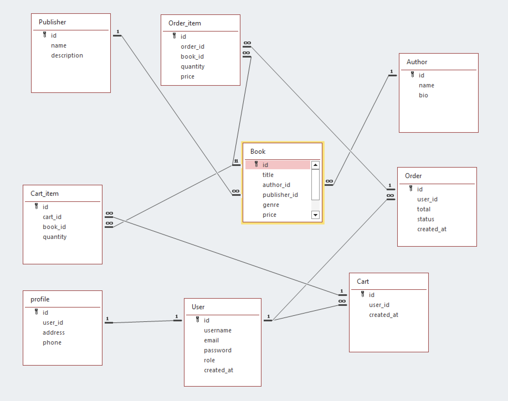

# biblioteque

## Description

Online bookstore; Users register and log/sign in; place orders, search books, authors on differents genres; Admins can manage orders, modify/remove existing books, add a new books and authors

### Details

* user friendly interface  
* shopping cart
* categorization: search, sort, filter books/genres 
* view details of the book/author 
* authentication 

### API Endpoints

| HTTP Verb | Endpoint                     | Action                                   |
|-----------|------------------------------|------------------------------------------|
| POST      | /api/auth/register           | To sign up a new user                    |
| POST      | /api/auth/login              | To log in an existing user               |
| GET       | /api/profile                 | To get user profile and order history    |
| PUT       | /api/profile                 | To update user profile                   |
| GET       | /api/books                   | To retrieve all books (can do with filters) |
| GET       | /api/books/:book_id          | To retrieve details of a single book     |
| POST      | /api/books                   | To create a new book *(admin only)*      |
| PUT       | /api/books/:book_id          | To edit a book *(admin only)*            |
| DELETE    | /api/books/:book_id          | To delete a book *(admin only)*          |
| GET       | /api/authors                 | To retrieve all authors                  |
| GET       | /api/authors/:authorId       | To retrieve details of a single author   |
| POST      | /api/authors                 | To create a new author *(admin only)*    |
| PUT       | /api/authors/:authorId       | To edit an author *(admin only)*         |
| DELETE    | /api/authors/:authorId       | To delete an author *(admin only)*       |
| GET       | /api/publishers              | To retrieve all publishers               |
| GET       | /api/publishers/:publisherId | To retrieve details of a publisher       |
| POST      | /api/publishers              | To create a new publisher *(admin only)* |
| PUT       | /api/publishers/:publisherId | To edit a publisher *(admin only)*       |
| DELETE    | /api/publishers/:publisherId | To delete a publisher *(admin only)*     |
| POST      | /api/cart/add                | To add a book to cart                    |
| GET       | /api/cart                    | To view cart contents                    |
| POST      | /api/cart/checkout           | To create an order from the cart         |
| GET       | /api/orders                  | To view user’s order history             |
| GET       | /api/about                   | To retrieve “About us” information       |


### About
#### `GET /api/about`
**Response** `200 OK`:
```json
{
  "about": "This is an online bookstore project."
}
```

### Auth
#### `POST /api/auth/register`
**Response** `201 Created`:
**Request Body**:
```json
{
  "username": "user1",
  "email": "user1@edu.ua",
  "password": "secret"
}
```
**Response body**:
```json
{
  "message": "User registered successfully",
  "user": {
    "id": 1,
    "username": "user1",
    "email": "user1@edu.ua"
  },
  "token": "jwt-token-example"
}
```

#### `POST /api/auth/login`
**Response** `200 OK`:
**Request Body**:
```json
{
  "email": "user1@edu.ua",
  "password": "secret"
}
```
**Response body**:
```json
{
  "message": "Login successful",
  "token": "jwt-token-example",
  "user": {
    "id": 1,
    "username": "user1",
    "email": "user1@edu.ua"
  }
}
```

### Profile
#### `GET /api/profile`
**Response** `200 OK`:
```json
{
  "id": 1,
  "username": "user1",
  "email": "user1@edu.ua",
  "orders": [
    { "order_id": 101, "total": 500, "status": "completed" },
    { "order_id": 102, "total": 300, "status": "processing" }
  ]
}
```

#### `PUT /api/profile`
**Response** `200 OK`:
**Request Body**:
```json
{
  "username": "newName",
  "address": "Kyiv, Ukraine",
  "phone": "+380501234567"
}
```
**Response body**:
```json
{
  "message": "Profile updated successfully",
  "profile": {
    "id": 1,
    "username": "newName",
    "email": "user1@edu.ua",
    "address": "Kyiv, Ukraine",
    "phone": "+380501234567"
  }
}
```

### Book
#### `GET /api/books`
**Response** `200 OK`:
```json
[
  {
    "id": 1,
    "title": "The City",
    "author": "Valerian Pidmohylnyi",
    "publisher": "A-BA-BA-HA-LA-MA-HA",
    "genre": "Novel",
    "price": 250
  }
]
```
**Response body**:
```json
{
  "id": 1,
  "title": "The City",
  "author": "Valerian Pidmohylnyi",
  "publisher": "A-BA-BA-HA-LA-MA-HA",
  "genre": "Novel",
  "price": 250,
  "description": "A Ukrainian classic novel"
}
```

#### `GET /api/books/:book_id`
**Response** `200 OK`:
```json
{
  "id": 1,
  "title": "The City",
  "author": "Valerian Pidmohylnyi",
  "publisher": "A-BA-BA-HA-LA-MA-HA",
  "genre": "Novel",
  "price": 250,
  "description": "A Ukrainian classic novel"
}
```
**Response body**:
```json
{
  "id": 1,
  "title": "The City",
  "author": "Valerian Pidmohylnyi",
  "publisher": "A-BA-BA-HA-LA-MA-HA",
  "genre": "Novel",
  "price": 250,
  "description": "A Ukrainian classic novel"
}
```

#### `POST /api/books` *(admin only)*
**Response** `201 Created`:
**Request Body**:
```json
{
  "title": "New Book",
  "author": "Author Name",
  "publisher": "Publisher Name",
  "genre": "Drama",
  "price": 300
}
```
**Response body**:
```json
{
  "message": "Book created successfully",
  "book": {
    "id": 5,
    "title": "New Book",
    "author": "Author Name",
    "publisher": "Publisher Name",
    "genre": "Drama",
    "price": 300
  }
}
```


#### `DELETE /api/books/:book_id` *(admin only)*
**Response** `200 OK`:
```json
{
  "message": "Book deleted successfully"
}
```

### Author
#### `GET /api/authors`
**Response** `200 OK`:
```json
[
  { "id": 1, "name": "Pidmohylnyi" },
  { "id": 2, "name": "Ivan Franko" }
]
```

#### `GET /api/authors/:authorId`
**Response** `200 OK`:
```json
{
  "id": 1,
  "name": "Valerian Pidmohylnyi",
  "books": [
    "The City",
    "Other Works"
  ]
}
```

#### `POST /api/authors` *(admin only)*
**Response** `201 Created`:
**Request Body**:
```json
{
  "name": "New Author"
}
```

#### `PUT /api/authors/:authorId` *(admin only)*
**Response** `200 OK`:
**Request Body**:
```json
{
  "name": "Updated Author"
}
```

#### `DELETE /api/authors/:authorId` *(admin only)*
**Response** `200 OK`:
```json
{
  "message": "Author deleted successfully"
}
```

### Publisher
#### `GET /api/publishers`
**Response** `200 OK`:
```json
[
  { "id": 1, "name": "A-BA-BA-HA-LA-MA-HA" },
  { "id": 2, "name": "Folio" }
]
```

#### `GET /api/publishers/:publisherId`
**Response** `200 OK`:
```json
{
  "id": 1,
  "name": "A-BA-BA-HA-LA-MA-HA",
  "books": [
    "The City",
    "Other Titles"
  ]
}
```

#### `POST /api/publishers` *(admin only)*
**Response** `200 OK`:
**Request Body**:
```json
{
  "name": "New Publisher"
}
```

#### `PUT /api/publishers/:publisherId` *(admin only)*
**Response** `200 OK`:
**Request Body**:
```json
{
  "name": "Updated Publisher"
}
```


#### `DELETE /api/publishers/:publisherId` *(admin only)*
**Response** `200 OK`:
```json
{
  "message": "Publisher deleted successfully"
}
```

### Cart
#### `POST /api/cart/add`
**Response** `200 OK`:
**Request Body**:
```json
{
  "book_id": 1,
  "quantity": 2
}
```


#### `GET /api/cart`
**Response** `200 OK`:
```json
[
  {
    "book_id": 1,
    "title": "The City",
    "quantity": 2,
    "price": 250
  },
  {
    "book_id": 2,
    "title": "Eneida",
    "quantity": 1,
    "price": 180
  }
]
```

#### `POST /api/cart/checkout`
**Response** `201 Created`:
```json
{
  "order_id": 101,
  "total": 680,
  "status": "pending"
}
```

#### `GET /api/orders`
**Response** `200 OK`:
```json
[
  {
    "order_id": 101,
    "total": 680,
    "status": "completed"
  },
  {
    "order_id": 102,
    "total": 300,
    "status": "pending"
  }
]
```

### Database schema

